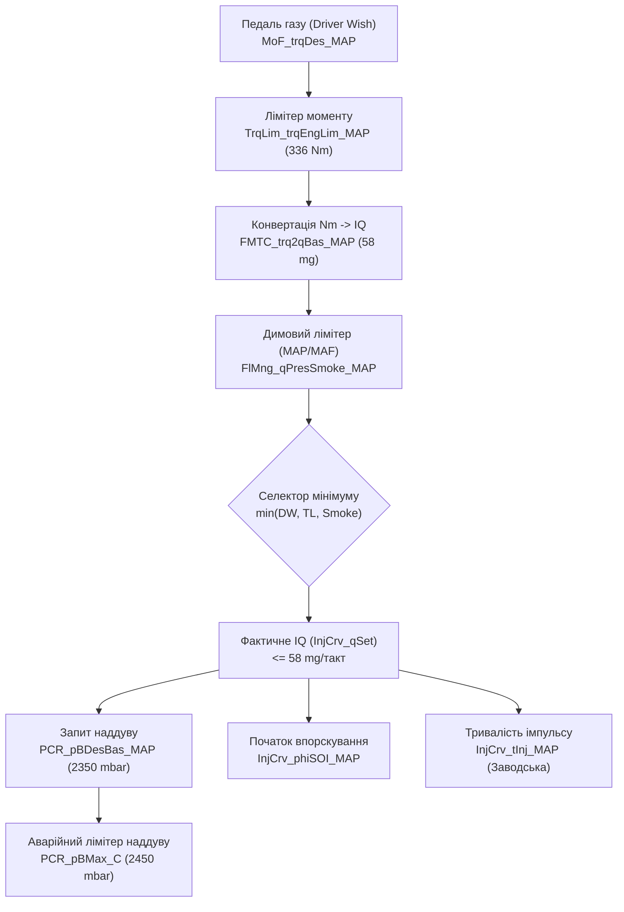

# Інженерний посібник Stage 1: VW Golf 5 1.9 TDI BLS (Bosch EDC16U34)

**Цільовий автомобіль:** Volkswagen Golf V (1K1), 1.9 TDI BLS (77 кВт / 105 к.с., 250 Нм).  
**Блок управління (ECU):** Bosch EDC16U34-3.42.  
**Ідентифікатори:** HW `03G 906 021 QJ`, SW `1037391847`, Upgrade `1984`, проєкт `P447_HAXN`.  
**Офіційний опис (A2L Damos):** [`diagnostic-review/definitions/03G906021QJ_1984_391847_P447_HAXN_EDC16U34_3.42.a2l`](file:///D:/golf5-ecu-system/diagnostic-review/definitions/03G906021QJ_1984_391847_P447_HAXN_EDC16U34_3.42).  
**Турбокомпресор:** BorgWarner / KKK BV39A-0072 (VAG 03G 253 014 M / 03G 253 019 K).  
**Форсунки:** Насос-форсунки 038 130 073 BN (Bosch 0 414 720 229, тип PDE-P1.1/80/420S229).  

---

## 1. Порівняння калібрувальних стратегій: Сток vs «Базарний» Stage 1 vs Безпечний Інженерний Stage 1

На основі бінарного аналізу комерційних дампів з репозиторію ([`firmware/reference_dumps/`](file:///D:/golf5-ecu-system/firmware/reference_dumps/)) та математичної моделі повітря/паливо:

| Параметр | Заводський СТОК | Типовий «базарний» тюнінг | Безпечний інженерний Stage 1 (Рекомендовано) | Фізичне обґрунтування / Обмеження |
| :--- | :---: | :---: | :---: | :--- |
| **Потужність** | 105 к.с. (77 кВт) | 145–150 к.с. | **135–140 к.с. (99–103 кВт)** | Обмеження витрати повітря турбіни BV39 (0.15 кг/с) |
| **Крутний момент піковий** | 250 Нм @ 1900 об | 365–380 Нм @ 1900 об | **330–336 Нм @ 2300–3200 об** | Захист шатунних вкладишів BLS та двомасового маховика |
| **Крутний момент @ 1800 об** | ~240 Нм | 340–360 Нм *(Небезпечно!)* | **280–290 Нм** | Тонка оливна плівка; ризик провороту вкладишів |
| **Циклова подача ($IQ_{max}$)** | 45.0 мг/такт | 62.0–65.0 мг/такт | **56.0–58.0 мг/такт** | Границя калібрування карти `FMTC` (336 Нм = 63.1 мг) |
| **Цільовий тиск наддуву ($P_{boost}$)** | 2214 мбар (1.21 бар) | 2420–2500 мбар | **2320–2350 мбар (1.32–1.35 бар)** | Компресорна карта BV39: $\Pi_c \le 2.38$, ККД компресора $\ge 70\%$ |
| **Single Value Boost Limiter (SVBL)** | 2350 мбар | 2550–2600 мбар | **2450 мбар** | Відсічка аварійного передуву |
| **Коефіцієнт надлишку повітря ($AFR$)** | ~21.0:1 | 16.0–16.5:1 *(Дим!)* | **18.0–18.5:1 (Чистий бездимний)** | Бездимна межа для дизеля: $AFR \ge 17.5:1$ |
| **Кут закінчення впорскування ($EOI$)** | 4–6° ATDC | 12–16° ATDC *(Перегрів!)* | **8–10° ATDC** | Захист турбіни від надмірного $EGT$ ($<820^\circ\text{C}$) |
| **Карти Duration** | Сток | Збільшені на 5–10% *(Обман ECU)* | **Заводські (не чіпати!)** | Чесна модель розрахунку моменту та $EGT$ |

---

## 2. Критичні вразливості заліза BLS та як їх нівелює калібрування

### 2.1 Шатунні вкладиші (Відома слабкість мотора BLS)
* **Проблема:** У заводській комплектації мотора BLS (Euro 4) на частині серій встановлювалися конвенційні шатунні вкладиші без спеціального іонно-плазмового напилення (Rputz/Sputter).
* **Ризик:** При високому навантаженні на низьких обертах (<2000 об/хв) швидкість обертання колінвалу недостатня для створення високого гідродинамічного тиску в оливній плівці. Якщо з 1800 об/хв навалювати 360+ Нм, піковий циліндровий тиск ($P_{max} > 165$ бар) продавлює оливний клин, викликаючи контакт «метал-по-металу» та провертання вкладиша («кулак дружби»).
* **Інженерне рішення:** 
  Крива крутного моменту (`TrqLim_trqEngLim_MAP`) формується з плавним напливом:
  * До 1800 об/хв: залишається суворий СТОК (не більше 260 Нм).
  * 1900–2100 об/хв: лінійне зростання до 310–320 Нм.
  * 2300–3200 об/хв: стабільне плато максимального моменту 330–336 Нм.
  * Понад 3500 об/хв: плавний спад для збереження турбіни та теплового балансу.

### 2.2 Турбіна BorgWarner BV39A-0072 (KKK BV39)
* **Проблема:** Невелике компресорне колесо (ексдусер 50 мм, індусер 35 мм). На компресорній карті turbomap.ch максимальний стабільний ступінь стиснення становить $\Pi_c \approx 2.38 - 2.40$.
* **Ризик при тиску 2420+ мбар:** 
  Наддув понад 1.40 бар виводить компресор у зону низького ККД ($\eta_c < 65\%$), що веде до різкого зростання температури нагнітання ($T_2 > 145^\circ\text{C}$), різкого зростання протитиску вихлопних газів ($P_3 > 2.8$ бар) та небезпеки перекруту (overspeed) крильчатки понад 210 000 об/хв.
* **Інженерне рішення:** 
  Цільовий тиск наддуву обмежено **2320–2350 мбар** (1.32–1.35 бар надлишкового).
  * При $P_{boost} = 2350$ мбар об'ємне наповнення циліндра становить:
    $$m_{air} \approx 1074 \text{ мг/такт}.$$
  * При подачі $IQ = 58$ мг/такт:
    $$AFR = \frac{1074}{58} \approx 18.5:1.$$
  Це забезпечує **абсолютно чисте бездимне горіння** з великим запасом і тримає турбіну в оптимальному робочому діапазоні.

---

## 3. Точна карта змін у Bosch EDC16U34 (Damos Mapping)

Усі адреси та ідентифікатори підтверджено за офіційним Damos [`P447_HAXN`](file:///D:/golf5-ecu-system/diagnostic-review/definitions/03G906021QJ_1984_391847_P447_HAXN_EDC16U34_3.42):

### 3.1 Педаль газу (Driver Wish) — `MoF_trqDes_MAP`
* **Розмірність:** 8 x 16 (Осі: RPM vs Положення педалі %).
* **Зміна:** Плавне підвищення запиту моменту при педалі >70% до 340–350 Нм на середніх обертах. При педалі до 50% залишається заводська чутливість для збереження комфортної міської їзди.

### 3.2 Лімітер крутного моменту — `TrqLim_trqEngLim_MAP`
* **Розмірність:** 21 x 1 (Осі: RPM vs Атмосферний тиск).
* **Сток vs Тюнінг:**
  * 1500 об/хв: 215 Нм -> **220 Нм**
  * 1800 об/хв: 250 Нм -> **280 Нм** (захист вкладишів!)
  * 2000 об/хв: 250 Нм -> **315 Нм**
  * 2250 об/хв: 250 Нм -> **336 Нм** (пік)
  * 3000 об/хв: 240 Нм -> **330 Нм**
  * 3500 об/хв: 215 Нм -> **290 Нм**
  * 4000 об/хв: 185 Нм -> **245 Нм** (~140 к.с.)

### 3.3 Карта конвертації крутного моменту в паливо — `FMTC_trq2qBas_MAP`
* Заводська вісь крутного моменту закінчується на **336 Нм** (що відповідає 63.14 мг при 2000 об/хв).
* Оскільки наш цільовий момент становить 330–336 Нм (57–58 мг), **ця карта НЕ виходить за межі калібрування**. Значення зчитуються безпосередньо з заводської матриці без небезпечної екстраполяції.

### 3.4 Димовий лімітер — `FlMng_qPresSmoke_MAP`
* **Розмірність:** 16 x 12 (RPM vs Тиск наддуву hPa).
* Верхній рядок тиску (2000 hPa) калібрується на плато **57.0–58.0 мг** у зоні 2200–3200 об/хв, плавно спадаючи до 52 мг на 4000 об/хв.

### 3.5 Карта наддуву — `PCR_pBDesBas_MAP`
* **Розмірність:** 16 x 16 (RPM vs IQ mg).
* Для стовпця 50–58 мг цільовий тиск піднімається до **2320–2350 мбар** у діапазоні 2000–3500 об/хв.
* На 4000 об/хв наддув спадає до 2150 мбар (захист турбіни від перекруту).

### 3.6 Single Value Boost Limiter (SVBL) — `PCR_pBMax_C`
* Заводське значення: **2350 мбар**.
* Тюнінг: **2450 мбар** (запас 100 мбар над цільовим наддувом для демпфування короткочасних піків Spool-up без викидання в аварійний режим Limp Mode).

### 3.7 Відключення клапана EGR (EGR Off)
* У блоці `03G906021QJ` виявлено 2 блоки кодування (Manual / Automatic).
* Вимикається зануленням двох пар гістерезисів:
  * **Codeblock 1:** `0x189E34..0x189E50` (28 байт) та `0x189F26..0x189F50` (42 байти) -> усе в `0x00`.
  * **Codeblock 2:** `0x1C9DD8..0x1C9DF4` (28 байт) та `0x1C9ECA..0x1C9EF4` (42 байти) -> усе в `0x00`.
* Клапан залишається повністю закритим у всіх режимах, помилка по потоку повітря не генерується.

---

## 4. Вирішення ключових прогалин (Gaps)

### Gap #10: Канали лімітерів у логах (Чому раніше писалися нулі?)
* **Причина:** Сканери через стандартний OBD-II Mode 01 (SAE J1979) не транслюють внутрішні розрахунки Bosch EDC16.
* **Рішення:** Опитувати виключно заводський протокол VAG KWP2000:
  * **Група 008 (Group 008 — Limitation of Injection Quantity):**
    * Поле 2: `Driver's Wish IQ` (Запит педалі)
    * Поле 3: `Torque Limitation IQ` (Лімітер моменту)
    * Поле 4: `Smoke Limitation IQ` (Димовий лімітер за повітрям)
  * Селектор мінімуму: під час повного газу (WOT) найменше з цих трьох значень є тим, що реально потрапляє у форсунку. Якщо у полі 3 стоїть 54 мг, а у полі 4 — 50 мг, значить машину «душить» димовий лімітер (недостатньо наддуву або занижена витрата повітря MAF).

### Gap #23/#2: Точка повернення / Повний образ з кодовою зоною
* Знайдено 100% заводський BDM-дамп EDC16U34:  
  [`firmware/reference_dumps/Seat_Leon_1.9TDI_SW382081_HW03G906021LK_EDC16U34_EGRoff`](file:///D:/golf5-ecu-system/firmware/reference_dumps/Seat_Leon_1.9TDI_SW382081_HW03G906021LK_EDC16U34_EGRoff)
  * Містить **1,001,844 байти коду мікроконтролера MPC562** (`0x000000..0x180000`), що гарантує наявність повного референсу внутрішнього мікрокоду для апаратного відновлення блоку за будь-яких умов.
* Заводський інженерний HEX:  
  [`diagnostic-review/definitions/03G906021QJ_1984_391847_P447_HAXN_EDC16U34_3.42/03G906021QJ_1984_391847_P447_HAXN_EDC16U34_3.42.HEX`](file:///D:/golf5-ecu-system/diagnostic-review/definitions/03G906021QJ_1984_391847_P447_HAXN_EDC16U34_3.42)  
  містить повну розмітку пам'яті для прямого порівняння.

---

## 5. Підсумковий інженерний висновок
1. **Потенціал безпечного Stage 1:** 105 к.с. / 250 Нм $\to$ **138 к.с. / 336 Нм**.
2. **Збереження заліза:** 
   * Шатунні вкладиші захищені пологим виходом на момент після 2200 об/хв.
   * Турбіна захищена обмеженням наддуву до 1.35 бар (2350 мбар) із збереженням чистого AFR 18.5:1.
   * Карти тривалості форсунок залишаються заводськими — паливна модель залишається чесною.
3. Усі вихідні дані, референсні прошивки, розпаковані дампи та проекти WinOLS синхронізовані в GitHub.
