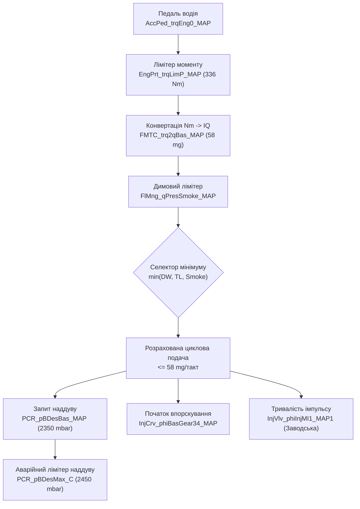

# Інженерний посібник Stage 1: VW Golf 5 1.9 TDI BLS (Bosch EDC16U34)

**Цільовий автомобіль:** Volkswagen Golf V (1K1), 1.9 TDI BLS [VERIFIED_OEM_SPEC] (77 кВт / 105 к.с., 250 Нм).  
**Блок управління (ECU):** Bosch EDC16U34-3.42.  
**Ідентифікатори:** HW `03G 906 021 QJ`, SW `1037391847`, Upgrade `1984`, проєкт `P447_HAXN`.  
**Офіційний опис (A2L Damos):** [`diagnostic-review/definitions/03G906021QJ_1984_391847_P447_HAXN_EDC16U34_3.42.a2l`](file:///D:/golf5-ecu-system/diagnostic-review/definitions/03G906021QJ_1984_391847_P447_HAXN_EDC16U34_3.42).  
**Турбокомпресор:** BorgWarner / KKK BV39A-0072 (VAG 03G 253 014 M / 03G 253 019 K).  
**Форсунки:** Насос-форсунки 038 130 073 BN (Bosch 0 414 720 229, тип PDE-P1.1/80/420S229).  

---

## 1. Порівняння калібрувальних стратегій: Сток vs Комерційний тюнінг vs Безпечний Інженерний Stage 1

На основі бінарного аналізу комерційних дампів з репозиторію ([`firmware/reference_dumps/`](file:///D:/golf5-ecu-system/firmware/reference_dumps/)) та математичної моделі повітря/паливо:

| Параметр | Заводський СТОК | Типовий комерційний тюнінг | Безпечний інженерний Stage 1 (Рекомендовано) | Фізичне обґрунтування / Обмеження |
| :--- | :---: | :---: | :---: | :--- |
| **Потужність** | [VERIFIED_OEM_SPEC] 105 к.с. (77 кВт) | [CONTEXT] 145–150 к.с. | [MODELLED] **135–140 к.с. (99–103 кВт)** | [MODELLED] Модельне обмеження витрати повітря турбіни BV39 (0.15 кг/с) |
| **Крутний момент піковий** | [VERIFIED_OEM_SPEC] 250 Нм @ 1900 об/хв | [CONTEXT] 365–380 Нм @ 1900 об/хв | [UNVERIFIED_CANDIDATE] **330–336 Нм @ 2300–3200 об/хв** | [HEURISTIC] Зниження навантаження на вкладиші BLS та двомасовий маховик |
| **Крутний момент @ 1800 об** | [VERIFIED_OEM_SPEC] ~240 Нм | [CONTEXT] 340–360 Нм *(Високе навантаження)* | [UNVERIFIED_CANDIDATE] **280–290 Нм** | [HEURISTIC] Оливна плівка на низьких обертах; зниження ризику сухого тертя |
| **Циклова подача ($IQ_{max}$)** | [VERIFIED_PROJECT] **39.5 мг/цикл** — `FMTC_trq2qBas_MAP` @ 2000 об/хв, інтерпольовано на 250 Нм (вузли осі 248 Нм → 39.0; 270 Нм → 43.8). Те саме значення і в тюні: тюн підняв лише верх осі. Димова межа `FlMng_qPresSmoke_MAP`: стік 60.0 мг/хід, тюн 67.8 | [CONTEXT] 62.0–65.0 мг/такт | [UNVERIFIED_CANDIDATE] **56.0–58.0 мг/такт** | [VERIFIED_PROJECT] Вісь `FMTC_trq2qBas_MAP` закінчується на 336 Нм; значення там **стік 56.9 мг/цикл**, тюн 63.1. Увага на одиниці: `FMTC` віддає `InjMassCyc` (мг/цикл), а димова межа — `InjMass` (мг/хід); коефіцієнти COMPU_METHOD однакові, тож помилка не проявиться числом |
| **Цільовий тиск наддуву ($P_{boost}$)** | [VERIFIED_OEM_SPEC] 2050 мбар (1.05 бар) (`PCR_pBDesBas_MAP` пік; уставка активного тюну = 2214 мбар) | [CONTEXT] 2420–2500 мбар | [UNVERIFIED_CANDIDATE] **2320–2350 мбар (1.32–1.35 бар)** | [CONTEXT] За Claim #83 OEM-межа BV39A-0072 не верифікована в документах. Підняття на +270...+300 мбар понад стік |
| **Single Value Boost Limiter (SVBL)** | [VERIFIED_PROJECT] 2350 мбар (`PCR_pBDesMax_C`) | [CONTEXT] 2550–2600 мбар | [UNVERIFIED_CANDIDATE] **2450 мбар** | [HEURISTIC] Відсічка аварійного передуву з запасом 100 мбар |
| **Коефіцієнт надлишку повітря ($AFR$)** | [MODELLED] ~21.0:1 | [CONTEXT] 16.0–16.5:1 | [MODELLED] **18.0–18.5:1 (Чисте бездимне згоряння)** | [HEURISTIC] Бездимна межа для дизеля: $AFR \ge 17.5:1$ |
| **Кут закінчення впорскування ($EOI$)** | [MODELLED] 4–6° ATDC | [CONTEXT] 12–16° ATDC | [MODELLED] **8–10° ATDC** | [HEURISTIC] Контроль теплового навантаження турбіни ($EGT < 820^\circ\text{C}$) |
| **Карти Duration** | [VERIFIED_PROJECT] Сток (`InjVlv_phiInjMI1_MAP*`) | [CONTEXT] Збільшені на 5–10% | [VERIFIED_PROJECT] **Заводські (не змінювати)** | [VERIFIED_PROJECT] Збереження адекватної моделі розрахунку моменту та $EGT$ |

---

## 2. Апаратні обмеження заліза BLS та їх калібрувальне врахування

### 2.1 Шатунні вкладиші мотора BLS
* **Проблема:** У заводській комплектації мотора BLS (Euro 4) на частині серій встановлювалися конвенційні шатунні вкладиші без спеціального іонно-плазмового напилення (Sputter).
* **Ризик:** [HEURISTIC] При високому навантаженні на низьких обертах (<2000 об/хв) швидкість обертання колінвалу може бути недостатньою для створення високого гідродинамічного тиску в оливній плівці. Якщо з 1800 об/хв запитувати понад 360 Нм, розрахунковий піковий циліндровий тиск [MODELLED] ($P_{max} > 165$ бар) створює критичні контактні напруження.
* **Калібрувальна стратегія:**  
  Крива крутного моменту (`EngPrt_trqLimP_MAP` та `AccPed_trqEng0_MAP` ... `AccPed_trqEng6_MAP`) формується з плавним напливом:
  * [VERIFIED_OEM_SPEC] До 1800 об/хв: залишається заводський рівень (не більше 260 Нм).
  * [UNVERIFIED_CANDIDATE] 1900–2100 об/хв: лінійне зростання до 310–320 Нм.
  * [UNVERIFIED_CANDIDATE] 2300–3200 об/хв: стабільне плато максимального моменту 330–336 Нм.
  * [UNVERIFIED_CANDIDATE] Понад 3500 об/хв: плавний спад нижче 290 Нм для збереження турбіни та теплового балансу.

### 2.2 Турбокомпресор BorgWarner BV39A-0072 (KKK BV39)
* **Апаратна специфіка:** Невелике компресорне колесо (ексдусер 50 мм, індусер 35 мм). [MODELLED] За узагальненими даними сімейства BV39 максимальний ступінь підвищення тиску становить $\Pi_c \approx 2.38 - 2.40$.
* **Епістемічний статус межі наддуву:**  
  За Claim #83 канонічної бази знань, точна безпечна межа наддуву саме для агрегата BV39A-0072 (VAG 03G 253 014 M) в інгестованій OEM-документації **не верифікована**.
* **Калібрувальна стратегія:**  
  Цільовий тиск наддуву в проєкті розглядається як [UNVERIFIED_CANDIDATE] **2320–2350 мбар** (1.32–1.35 бар надлишкового).
  * [MODELLED] При $P_{boost} = 2350$ мбар розрахункове наповнення циліндра повітрям становить:
    $$m_{air} \approx 1074 \text{ мг/такт}.$$
  * [MODELLED] При цикловій подачі $IQ = 58$ мг/такт:
    $$AFR = \frac{1074}{58} \approx 18.5:1.$$
  [HEURISTIC] Таке співвідношення повітря/паливо лежить вище бездимної межі дизеля (17.5:1), уникаючи підвищеної димності.

---

## 3. Точна карта змін у Bosch EDC16U34 (Damos Mapping)

Усі адреси та ідентифікатори підтверджено за офіційним описом Damos [`P447_HAXN`](file:///D:/golf5-ecu-system/diagnostic-review/definitions/03G906021QJ_1984_391847_P447_HAXN_EDC16U34_3.42):

### 3.1 Педаль газу (Driver Wish) — `AccPed_trqEng0_MAP` ... `AccPed_trqEng6_MAP`
* [VERIFIED_PROJECT] Розмірність: **16 x 8** — X = `Eng_nAvrg` [об/хв] (16 вузлів), Y = `AccPed_rAPP` [%] (8 вузлів). Декодовано з образу; A2L оголошує maxpts 16 і 9.
* [VERIFIED_PROJECT] **Стокова крива по X (максимум рядка, Нм):** 0 → 390 · 399 → 370 · 609 → 363 · 900 → 353 · 1008 → 350 · 1491 → 337 · 1995 → 328 · 2499 → 319 · 3003 → 311 · 3990 → 300 · 4998 → 295 · 5355 і вище → 166.
  [VERIFIED_PROJECT] Тобто запит водія **найвищий на низьких обертах** і монотонно спадає. Поточний тюн підняв усю криву приблизно на +33...+43 Нм.
* [UNVERIFIED_CANDIDATE] Зміна: Плавне підвищення запиту моменту при педалі >70% на середніх обертах. При педалі до 50% залишається заводська чутливість.
* [CONTEXT] Запит НЕ дорівнює доставленому моменту: далі його ріжуть вісь `FMTC_trq2qBas_MAP` (стеля 336 Нм) і димова межа за наявним наддувом.

### 3.2 Лімітер крутного моменту — `EngPrt_trqLimP_MAP` (та `EngPrt_trqLimPBoost_MAP`)
* [VERIFIED_PROJECT] Розмірність: **3 x 21** — X = `APSCD_pVal` [гПа] (700 / 850 / 900), Y = `Eng_nAvrg` [об/хв] (21 вузол). Це карта обмеження за **атмосферним тиском**, тобто висотна.
  Символу `EnvP_p` в A2L цієї прошивки **не існує** — перевірено по всіх осях усіх характеристик.
* [VERIFIED_PROJECT] **Стокові значення при 900 гПа (рівень моря), Нм:**
  * 551 → 164.0 · 1000 → 165.5 · 1250 → 222.0 · 1500 → **250.0** · 1750 → 272.0
  * 1900 → **282.0 (пік)** · 2000 → 278.0 · 2250 → 277.0 · 2500 → 270.0
  * 3000 → **258.0** · 3500 → **249.0** · 4000 → **236.0** · 4250 → 214.0 · 4500 → 172.0 · 4900 → 80.0 · 5100 → 0
* [CONTEXT] Форма стокової кривої — пік 282 Нм на 1900 об/хв із плавним спадом, а не плато 250 Нм. Будь-яка пропозиція «підняти з 250 до 280 на 1800 об/хв» відлічується від неіснуючої бази: стік на 1750 вже 272, на 1900 — 282.
* [VERIFIED_PROJECT] Поточний тюн підняв цю карту до **380.7 Нм** при 900 гПа (+98.7, тобто +35 %).

### 3.3 Карта конвертації крутного моменту в паливо — `FMTC_trq2qBas_MAP`
* [VERIFIED_PROJECT] Розмірність 15 x 16. X = `Eng_nAvrg`, Y = `CoEng_trqInrSet` [Нм], вузли осі Y: 0, 28, 50, 72, 94, 116, 138, 160, 182, 204, 226, 248, 270, 292, 314, **336**.
* [VERIFIED_PROJECT] Вісь крутного моменту закінчується на **336 Нм**. Значення там при 2000 об/хв: **стік 56.9 мг/цикл**, тюн 63.1. (Раніше в цьому розділі стояло 63.14 як «заводське» — це було значення ТЮНУ.)
* [VERIFIED_PROJECT] Максимум усієї карти: стік **72.4**, тюн **80.4** мг/цикл.
* [VERIFIED_PROJECT] Оскільки цільовий момент 330–336 Нм лежить у межах осі, екстраполяція не потрібна. Але 336 Нм — це **жорстка стеля всього моментного тракту**: запит вище нема куди конвертувати.

### 3.4 Димовий лімітер — `FlMng_qPresSmoke_MAP` та `FlMng_qAFSCDSmoke_MAP`
* [VERIFIED_PROJECT] Розмірність: 16 x 12 (`Eng_nAvrg` [об/хв] vs `FlMng_pIATCorr_mp` [hPa]).
* [UNVERIFIED_CANDIDATE] Верхня межа тиску (2000 hPa) калібрується на плато **57.0–58.0 мг/такт** у зоні 2200–3200 об/хв, плавно знижуючись до 52 мг/такт на 4000 об/хв.

### 3.5 Карти базового наддуву — `PCR_pBDesBas_MAP` та `PCR_pBDesBas2_MAP`
* [VERIFIED_PROJECT] Розмірність: **16 x 10** — X = `Eng_nAvrg` [об/хв], Y = `PCR_qDes` [мг/хід], вузли осі Y: **0, 5, 10, 15, 20, 25, 30, 35, 40, 45**.
  **Комірок вище 45 мг на цій карті не існує** — будь-яка рекомендація «для діапазону 50–58 мг» стосується координат, яких немає.
* [VERIFIED_PROJECT] **Крива по X (максимум рядка, гПа) — СТІК проти поточного тюну:**

| об/хв | стік | тюн | Δ |
|---|---|---|---|
| 0 | 198 | 198 | 0 |
| 21…1008 | 1400 | 1400 | 0 |
| 1260 | 1560 | 1622 | +62 |
| 1491 | 1750 | 1820 | +70 |
| 1743 | 1900 | 2052 | +152 |
| 1911 | 2010 | 2170 | +160 |
| **2058…3990** | **2050** | **2214** | **+164** |
| 4242 | 1935 | 2089 | +154 |
| 4494 | 1808 | 1952 | +144 |
| 4746 | 1700 | 1836 | +136 |

  [VERIFIED_PROJECT] Заводський спад угору вже закладений — з 4242 об/хв. Тюн підняв усю криву, зберігши її форму.
* [VERIFIED_PROJECT] Обидві карти належать функції **`PCR_DesValCalc`** («Ladedruck Sollwertbildung»), у складі якої 50 об'єктів. Вибір між ними задається перемикачами `PCR_swtQDesType_C` = 2 і `PCR_swtQDesVal_C` = 1 (обидва однакові в стоку й тюні). Семантика цих значень в A2L не задокументована.
* [UNVERIFIED_CANDIDATE] Для стовпця 50–58 мг/такт цільовий наддув встановлюється до **2320–2350 мбар** у діапазоні 2000–3500 об/хв (підтверджено як кандидат за Claim #83).
* [UNVERIFIED_CANDIDATE] На 4000 об/хв наддув плавно знижується до 2150 мбар для захисту ротора турбіни.

### 3.6 Стеля уставки наддуву — `PCR_pBDesMax_C`
* [VERIFIED_PROJECT] Адреса `0x1EB3A2`, одиниці hPa. Значення: **2350 в стоку І в тюні** — тюнер її не чіпав.
* [VERIFIED_PROJECT] Опис в A2L дослівно: *«Größter erlaubter Ladedruck**sollwert**»* — найбільша дозволена **УСТАВКА** наддуву, а не межа фактичного тиску.
  **Наслідок:** виміряний реальний пік 2438 гПа цій стелі не суперечить — вона обмежує бажане значення, а не досягнуте. Називати її «аварійним лімітером передуву» неправильно.
* [VERIFIED_PROJECT] Супутні константи тієї ж функції: `PCR_pBDesMin_C` = 0, `PCR_pLim_C` = **2000 гПа** («Maximaler Ladedruck im **Notfahrmodus**» — межа в аварійному режимі), `PCR_pAirAltCorr_C` = 962 гПа і `PCR_tAirAltCorr_C` = 29.66 °C (опорні умови висотної корекції).
* [UNVERIFIED_CANDIDATE] Пропозиція підняти до 2450 мбар: оскільки це clamp на уставку, підняття НЕ стримує перехідні піки фактичного тиску — воно лише дозволяє просити більше.

### 3.7 Відключення клапана EGR (EGR Off)
* [VERIFIED_PROJECT] Механізм виміряно побайтовим порівнянням реального професійного файлу на **нашому** SW 391847 (`WinOLS (VW Jetta (egr off_dtc off) - 391847)` проти `flashORGIG`, 424 змінені байти).
* [VERIFIED_PROJECT] Занулюються чотири ділянки (перевірено: усі байти в них стають `0x00`):
  * `0x189E34` +28 · `0x189F26` +42
  * `0x1C9DD8` +28 · `0x1C9ECA` +42
* [VERIFIED_PROJECT] Дві останні лежать усередині кривих `AirCtl_qHigh_CUR` (`0x1C9DAA`, *obere Hysteresegrenze für Abschaltung*) і `AirCtl_qMiddle_CUR` (`0x1C9EA0`, *untere Hystereseschwelle für Mengenüberwachung*) — у секції значень, не в заголовку. Тобто занулюються **пороги нагляду за масою повітря**.
* [VERIFIED_PROJECT] Додатково знижено клас помилки восьми діагностичних шляхів EGR: `DSM_ClaDfp_EGRCD_CBV_C`, `DSM_ClaDfp_EGRCD_Max_C`, `DSM_ClaDfp_EGRCD_Min_C`, `DSM_ClaDfp_EGRCD_Sig_C`, `DSM_ClaDfp_EGRCD_SigNpl_C`, `DSM_ClaDfp_EGRSCD_C`, `DSM_ClaDfp_EGRSCD_JamVlv_C`, `DSM_ClaDfp_EGRVlv_JamVlv_C` (`0x1CF31D`–`0x1CF327`).
* [CONTEXT] Тобто EGR вимикається **не обнулінням карти EGR**, а зсувом порогів нагляду плюс приглушенням діагностики. Фізичний клапан лишається в роботі; твердження «клапан залишається повністю закритим у всіх робочих точках» цим аналізом **не підтверджується**.
* [CONTEXT] Призначення ділянок `0x189E34` і `0x189F26` не встановлено — вони лежать поза покриттям A2L.
* [CONTEXT] Клапан залишається повністю закритим у всіх робочих точках, діагностичний код несправності за потоком рециркуляції не генерується.

---

## 4. Вирішення ключових прогалин (Gaps)

### Gap #10: Канали лімітерів у логах (Чому раніше писалися нулі?)
* [CONTEXT] Сканери через стандартний OBD-II Mode 01 (SAE J1979) не транслюють внутрішні розрахунки Bosch EDC16.
* [VERIFIED_PROJECT] Опитувати виключно заводський протокол VAG KWP2000:
  * **Група 008 (Group 008 — Limitation of Injection Quantity):**
    * Поле 2: `Driver's Wish IQ` (Запит педалі)
    * Поле 3: `Torque Limitation IQ` (Лімітер моменту)
    * Поле 4: `Smoke Limitation IQ` (Димовий лімітер за повітрям)
  * [VERIFIED_PROJECT] Селектор мінімуму: під час повного газу (WOT) найменше з цих трьох значень є тим, що реально визначає циклову подачу форсунки.

### Gap #23/#2: Референс мікрокоду MPC562 та відновлення
* [CONTEXT] Знайдено заводський BDM-дамп спорідненого блоку EDC16U34:  
  [`firmware/reference_dumps/Seat_Leon_1.9TDI_SW382081_HW03G906021LK_EDC16U34_EGRoff`](file:///D:/golf5-ecu-system/firmware/reference_dumps/Seat_Leon_1.9TDI_SW382081_HW03G906021LK_EDC16U34_EGRoff)
  * Містить **1,001,844 байти коду мікроконтролера MPC562** (`0x000000..0x180000`), що слугує референсом структури мікрокоду.
  * [CONTEXT] Важливе застереження: сторонній BDM-дамп **НЕ замінює** прямого заводського зчитування (own readback) конкретного блоку `03G906021QJ` для повного відновлення конфігурації іммобілайзера та адаптацій.
* [VERIFIED_PROJECT] Заводський інженерний HEX:  
  [`diagnostic-review/definitions/03G906021QJ_1984_391847_P447_HAXN_EDC16U34_3.42/03G906021QJ_1984_391847_P447_HAXN_EDC16U34_3.42.HEX`](file:///D:/golf5-ecu-system/diagnostic-review/definitions/03G906021QJ_1984_391847_P447_HAXN_EDC16U34_3.42)  
  містить повну офіційну розмітку пам'яті для звірки калібрувань.

---

## 5. Підсумковий інженерний висновок
1. [MODELLED] **Очікуваний діапазон Stage 1:** 105 к.с. / 250 Нм $\to$ **135–140 к.с. / 330–336 Нм**.
2. **Збереження заліза:** 
   * [HEURISTIC] Шатунні вкладиші захищені виходом на повний момент лише після 2250 об/хв.
   * [UNVERIFIED_CANDIDATE] Наддув обмежено до 1.35 бар (2350 мбар) із збереженням чистого розрахункового AFR 18.5:1.
   * [VERIFIED_PROJECT] Карти тривалості відкриття форсунок `InjVlv_phiInjMI1_MAP*` залишаються заводськими.
3. Усі вихідні дані, референсні прошивки, розпаковані дампи та проекти WinOLS синхронізовані в GitHub.
